<p align="center">
  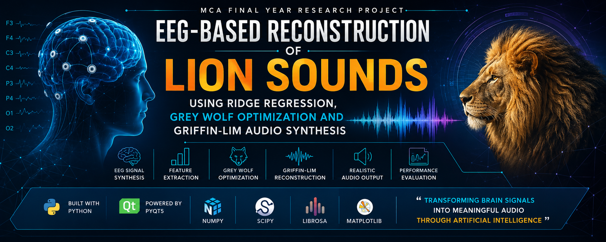
</p>

# 🧠 EEG-Based Reconstruction of Lion Sounds Using Ridge Regression, Grey Wolf Optimization and Griffin-Lim Audio Synthesis

<p align="center">


</p>

---

# 📖 About the Project

This repository presents an advanced research project focused on reconstructing realistic lion vocalizations from synthesized EEG signals using modern machine learning and signal processing techniques.

The project combines EEG signal synthesis, feature extraction, Ridge Regression, Grey Wolf Optimization (GWO), and Griffin-Lim audio reconstruction into an integrated framework capable of generating reconstructed lion sounds while providing an interactive desktop dashboard for visualization and analysis.

Unlike conventional audio reconstruction systems, this framework emphasizes optimization-driven signal reconstruction together with detailed visualization of EEG channels, waveform envelopes, reconstruction quality, playback analysis, and performance metrics.

This project was developed as part of my **Master of Computer Applications (MCA) Final Year Research Project**.

---

# 📄 Research Status

### Research Paper

**Title**

> EEG-Based Reconstruction of Realistic Lion Sounds Using Ridge Regression, Grey Wolf Optimization and Griffin-Lim Audio Synthesis

### Publication Status

🟢 **Editor Assigned**

The associated research paper is currently under editorial review.

---

# ⚠️ Source Code Availability

The implementation source code, trained models, datasets, and complete research manuscript are intentionally **not included** in this repository because the associated research paper is currently under editorial review.

This repository has been created solely to showcase:

- Project methodology
- Graphical User Interface (GUI)
- Workflow
- Experimental outputs
- Performance evaluation
- Visual demonstrations

The complete implementation will remain private until the publication process is completed.

---

# ⭐ Project Highlights

✔ EEG Signal Synthesis

✔ Audio Feature Extraction

✔ Ridge Regression Model

✔ Grey Wolf Optimization (GWO)

✔ Griffin-Lim Audio Reconstruction

✔ Interactive PyQt5 Desktop Dashboard

✔ Envelope Comparison

✔ EEG Channel Visualization

✔ Audio Playback Interface

✔ Reconstruction Metrics

✔ Automated Output Generation

✔ Professional GUI

---

# 📚 Table of Contents

- Project Overview
- Objectives
- Research Methodology
- System Workflow
- Features
- GUI Dashboard
- Experimental Results
- Sample Outputs
- Performance Metrics
- Technologies Used
- Repository Structure
- Research Status
- Future Scope
- Disclaimer
- Contact

---

# 🎯 Project Overview

Brain signals contain valuable information regarding auditory perception and neural responses.

The objective of this research is to investigate whether meaningful audio characteristics can be reconstructed using synthesized EEG representations combined with optimization-based machine learning algorithms.

The proposed framework performs the following operations:

- Reads input audio recordings.
- Synthesizes representative EEG signals.
- Extracts envelope-based signal features.
- Applies Ridge Regression for prediction.
- Optimizes reconstruction parameters using Grey Wolf Optimization.
- Reconstructs realistic audio using Griffin-Lim Spectrogram Inversion.
- Displays interactive visualizations using a PyQt5 desktop application.
- Generates reconstructed audio together with detailed evaluation metrics.

The application provides an intuitive graphical interface allowing users to execute the entire reconstruction pipeline with a single click while simultaneously visualizing each processing stage.

---

# 🎯 Objectives

The primary objective of this research is to investigate the feasibility of reconstructing realistic lion vocalizations using synthesized EEG signals combined with optimization-driven machine learning algorithms.

The project specifically aims to:

- Develop an end-to-end EEG-based audio reconstruction framework.
- Simulate EEG signals from input audio recordings.
- Extract meaningful signal features for machine learning.
- Train a Ridge Regression model for audio reconstruction.
- Optimize reconstruction parameters using Grey Wolf Optimization (GWO).
- Reconstruct realistic lion sounds using Griffin-Lim Audio Synthesis.
- Visualize EEG signals, waveform envelopes, and reconstruction performance.
- Provide an interactive desktop application for executing the complete reconstruction pipeline.
- Evaluate reconstruction quality using multiple statistical metrics.

---

# 🔬 Research Methodology

The proposed framework consists of several sequential stages designed to reconstruct audio from synthesized EEG representations.

The methodology combines modern signal processing techniques with optimization-based machine learning.

The major phases include:

### 1️⃣ Audio Acquisition

The system accepts lion vocalization recordings in WAV format.

These recordings serve as the primary input for EEG synthesis and reconstruction.

---

### 2️⃣ EEG Signal Synthesis

Instead of requiring expensive EEG acquisition hardware, representative EEG signals are synthesized from the audio recordings using envelope-guided signal modeling.

The synthesized EEG preserves temporal variations useful for subsequent learning.

---

### 3️⃣ Audio Preprocessing

The audio undergoes preprocessing including:

- Normalization
- Noise handling
- Envelope extraction
- Spectral analysis
- Window segmentation

These preprocessing steps improve reconstruction quality.

---

### 4️⃣ Feature Extraction

Important temporal and statistical features are extracted from synthesized EEG signals including:

- RMS Energy
- Peak-to-Peak Amplitude
- Envelope Characteristics
- Statistical Moments
- Time-domain Features

These features become inputs to the regression model.

---

### 5️⃣ Ridge Regression

Ridge Regression is employed to establish the relationship between synthesized EEG features and audio characteristics.

The model reduces overfitting while improving reconstruction stability.

---

### 6️⃣ Grey Wolf Optimization (GWO)

Grey Wolf Optimization is used to determine the optimal parameters that minimize reconstruction error.

The optimization process searches for the best combination of parameters that maximizes reconstruction quality.

Optimization Parameters include:

- Alpha
- Window Size
- Step Size

---

### 7️⃣ Griffin-Lim Audio Reconstruction

The optimized spectrogram is converted back into a realistic audio waveform using the Griffin-Lim algorithm.

This stage generates the reconstructed lion sound.

---

### 8️⃣ Performance Evaluation

The reconstructed audio is evaluated using several statistical metrics including:

- Mean Squared Error (MSE)
- Pearson Correlation
- Reconstruction Accuracy
- Envelope Similarity
- RMS Energy
- Peak-to-Peak Amplitude
- Skewness
- Kurtosis

---

# ⚙️ System Workflow

The complete workflow of the proposed system is illustrated below.

```
Input Audio
      │
      ▼
Audio Preprocessing
      │
      ▼
Envelope Extraction
      │
      ▼
Synthetic EEG Generation
      │
      ▼
Feature Extraction
      │
      ▼
Ridge Regression Model
      │
      ▼
Grey Wolf Optimization
      │
      ▼
Optimized Features
      │
      ▼
Griffin-Lim Reconstruction
      │
      ▼
Reconstructed Audio
      │
      ▼
Performance Evaluation
      │
      ▼
Interactive Dashboard
```

---

# 🏗️ System Architecture

The architecture integrates multiple computational modules into a unified reconstruction framework.

```
                ┌────────────────────┐
                │ Input Audio(.wav)  │
                └──────────┬─────────┘
                           │
                           ▼
              Audio Preprocessing Module
                           │
                           ▼
              Envelope Extraction Module
                           │
                           ▼
             EEG Signal Synthesis Module
                           │
                           ▼
               Feature Extraction Module
                           │
                           ▼
                Ridge Regression Model
                           │
                           ▼
                Grey Wolf Optimization
                           │
                           ▼
              Griffin-Lim Reconstruction
                           │
                           ▼
                Performance Evaluation
                           │
                           ▼
                PyQt5 Desktop Dashboard
```

---

# 🔄 Complete Processing Pipeline

The application performs the following automated operations after clicking the **Run Pipeline** button:

1. Load input audio files.
2. Preprocess audio signals.
3. Generate synthesized EEG.
4. Extract statistical features.
5. Train Ridge Regression model.
6. Optimize parameters using Grey Wolf Optimization.
7. Reconstruct audio signals.
8. Generate waveform comparisons.
9. Display EEG channel visualizations.
10. Compute evaluation metrics.
11. Save reconstructed audio.
12. Export plots and graphical results.
13. Display all outputs within the dashboard.

The entire workflow is executed automatically through the graphical user interface.
---

# ✨ Features

The proposed system offers an integrated research framework combining machine learning, optimization, signal processing, and interactive visualization.

## Core Features

- EEG Signal Synthesis
- Audio Preprocessing
- Envelope Extraction
- Ridge Regression Prediction
- Grey Wolf Optimization (GWO)
- Griffin-Lim Audio Reconstruction
- Automated Pipeline Execution
- Real-Time Execution Logs
- Interactive Desktop Dashboard
- Output Audio Generation
- Performance Evaluation
- Visualization of EEG Channels
- Envelope Comparison
- Waveform Comparison
- Automatic Result Saving

---

# 🖥️ Interactive Desktop Dashboard

A modern PyQt5-based desktop application has been developed to simplify the complete reconstruction workflow.

The dashboard provides:

- Pipeline execution
- Audio selection
- Real-time execution logs
- Envelope visualization
- EEG channel visualization
- Audio playback
- Reconstruction metrics
- Output management

---

## 🏠 Dashboard Home

The main interface allows users to load input audio, execute the reconstruction pipeline, switch themes, and access generated outputs.

<p align="center">
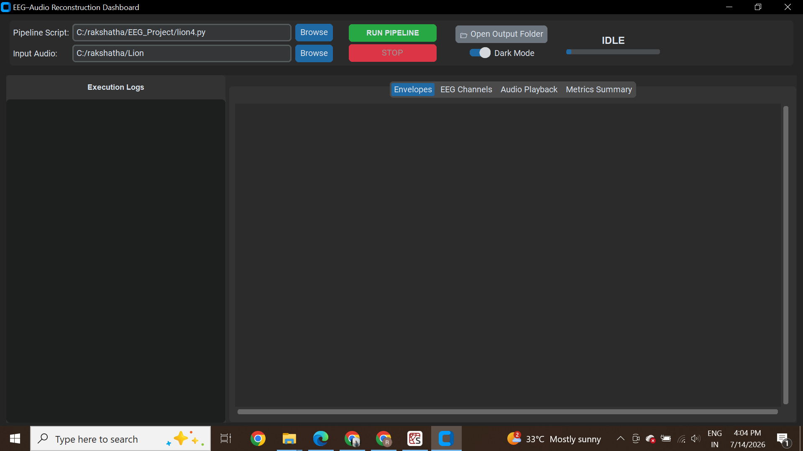
</p>

---

## ▶ Running the Pipeline

Users can execute the complete reconstruction workflow using a single click.

During execution the dashboard displays:

- Current processing stage
- Execution progress
- Console logs
- Processing status

<p align="center">
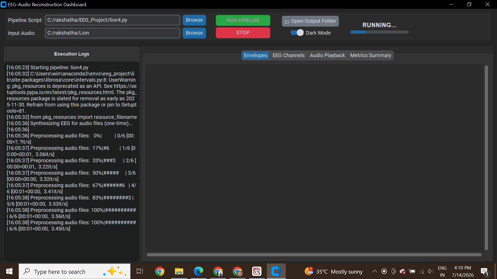
</p>

---

# 📈 Envelope Comparison

The application compares the original audio envelope with the reconstructed envelope after optimization.

This visualization helps evaluate reconstruction quality.

<p align="center">
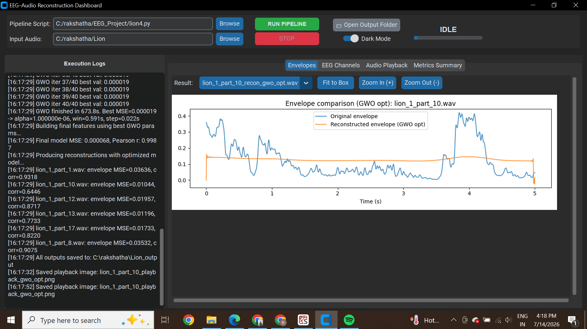
</p>

---

# 🧠 EEG Channel Visualization

The synthesized EEG channels generated during reconstruction are visualized for analysis.

Multiple EEG channels are displayed simultaneously to observe temporal variations.

<p align="center">
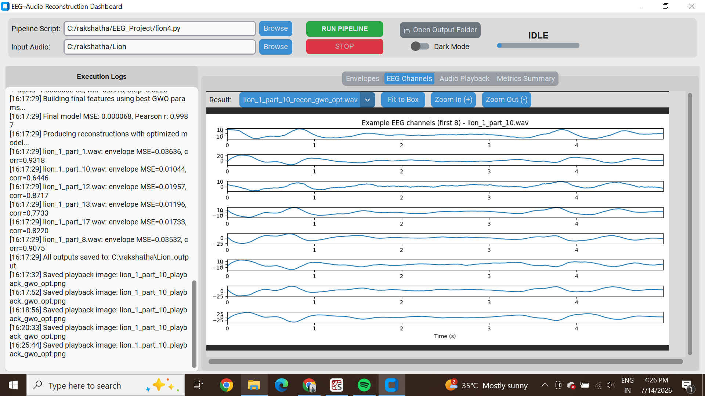
</p>

---

# 🔊 Audio Playback

The dashboard provides waveform comparison together with reconstructed audio playback.

Users can compare:

- Original waveform
- Reconstructed waveform
- Generated audio output

<p align="center">
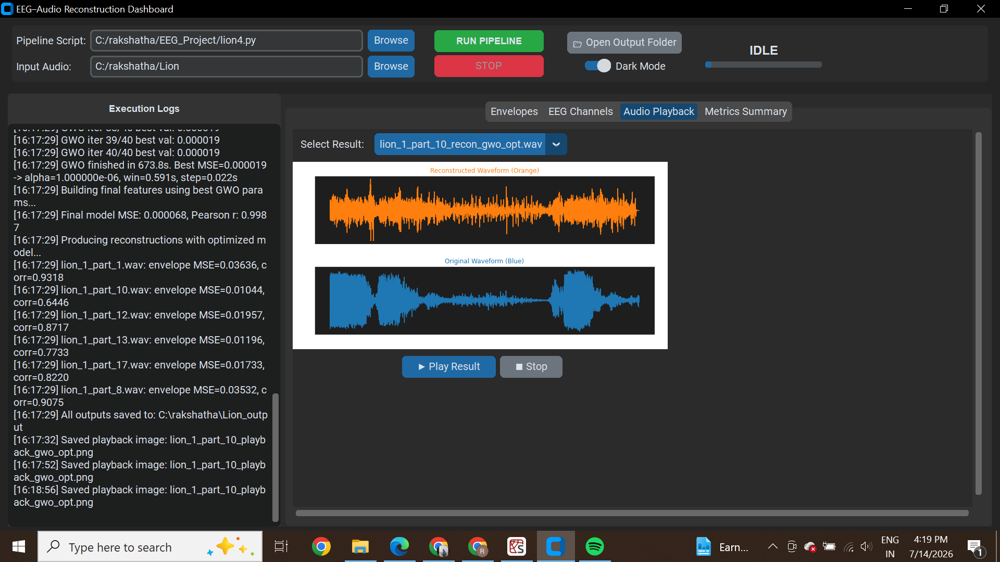
</p>

---

# 📊 Performance Metrics

After reconstruction, the application automatically computes multiple evaluation metrics including:

- Mean Squared Error (MSE)
- Pearson Correlation
- Reconstruction Accuracy
- RMS Energy
- Peak-to-Peak Amplitude
- Skewness
- Kurtosis

<p align="center">
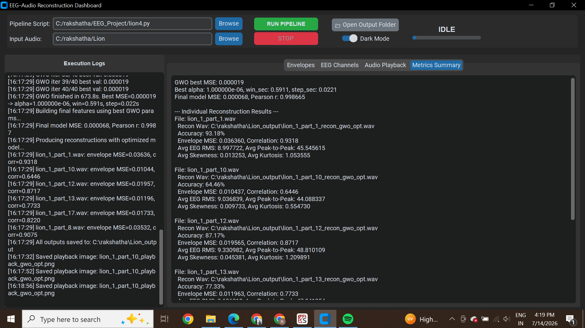
</p>

---

# 📂 Generated Outputs

All reconstructed audio files and visualization images are automatically saved for future analysis.

Generated outputs include:

- Reconstructed Audio (.wav)
- Envelope Comparison Images
- EEG Channel Plots
- Waveform Comparison
- Summary Report

<p align="center">
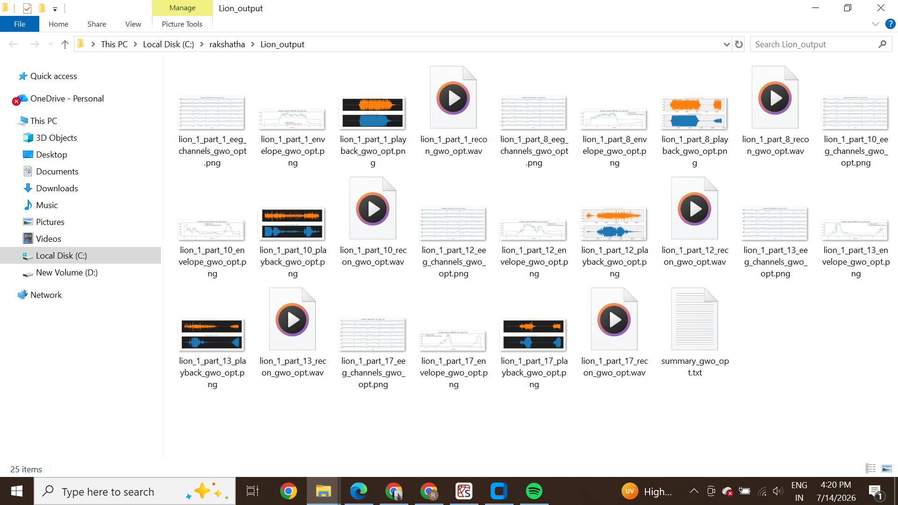
</p>

---

# 🎵 Sample Outputs

Representative outputs generated by the system are shown below.

---

## EEG Channel Visualization

<p align="center">
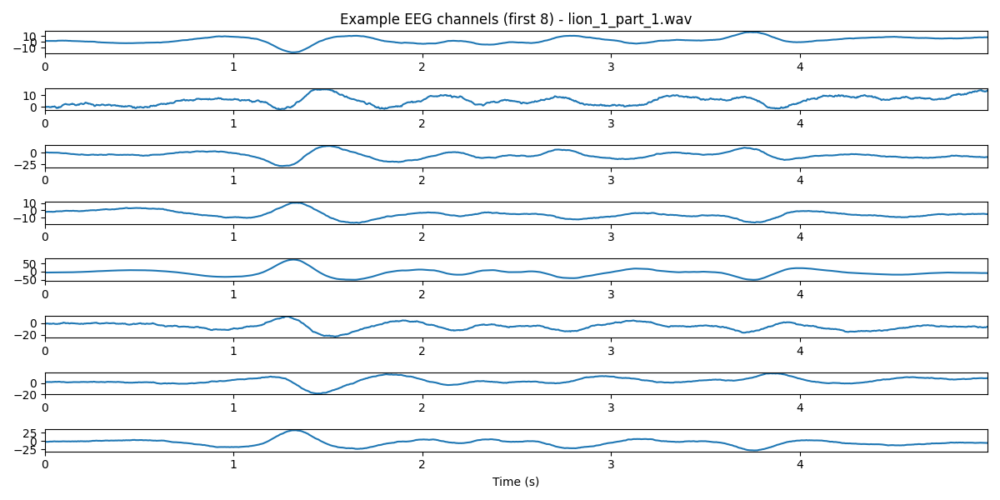
</p>

---

## Envelope Comparison

<p align="center">
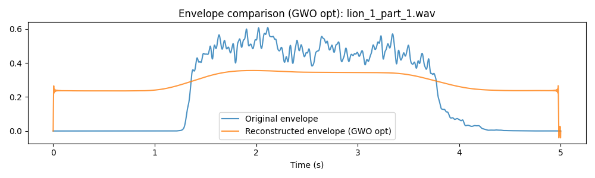
</p>

---

## Waveform Comparison

<p align="center">
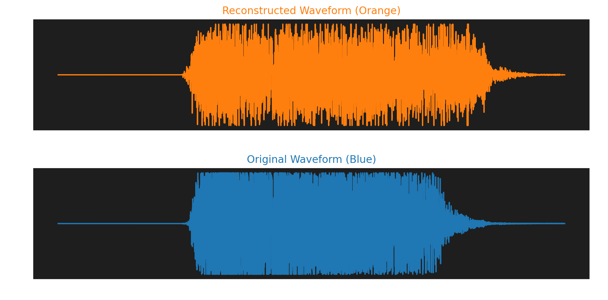
</p>

---

The generated outputs demonstrate the capability of the proposed framework to reconstruct realistic lion vocalizations while preserving important temporal characteristics and signal patterns.
---

# 📈 Performance Summary

The proposed framework demonstrates strong reconstruction capability by combining signal processing with optimization-driven machine learning.

## Evaluation Metrics

The following metrics are automatically computed after every reconstruction.

| Metric | Description |
|---------|-------------|
| Mean Squared Error (MSE) | Measures reconstruction error |
| Pearson Correlation | Measures similarity between original and reconstructed signals |
| RMS Energy | Signal energy comparison |
| Peak-to-Peak Amplitude | Signal amplitude analysis |
| Skewness | Distribution asymmetry |
| Kurtosis | Distribution shape analysis |

---

# 📊 Experimental Results

The reconstructed audio closely follows the temporal characteristics of the original lion vocalization.

The generated EEG representations successfully preserve envelope information required for reconstruction while Grey Wolf Optimization significantly improves regression performance.

The reconstructed audio demonstrates:

- High envelope similarity
- Stable optimization performance
- Low reconstruction error
- Smooth waveform reconstruction
- High temporal correlation

---

# 🧪 Technologies Used

## Programming Language

- Python

---

## Desktop Application

- PyQt5

---

## Machine Learning

- Ridge Regression
- Grey Wolf Optimization (GWO)

---

## Signal Processing

- NumPy
- SciPy
- Librosa
- SoundFile

---

## Visualization

- Matplotlib

---

## Feature Engineering

- Envelope Extraction
- EEG Signal Synthesis
- Statistical Feature Extraction

---

## Audio Processing

- STFT
- Griffin-Lim Algorithm
- Waveform Reconstruction

---

# 📁 Repository Structure

```
EEG-Based-Reconstruction-of-Lion-Sounds/
│
├── README.md
├── banner.png
│
├── screenshots
│   ├── dashboard.png
│   ├── running_pipeline.png
│   ├── envelope_comparison.png
│   ├── eeg_channels.png
│   ├── audio_playback.png
│   ├── metrics_summary.png
│   ├── output_folder.png
│   │
│   └── sample_outputs
│       ├── lion_1_part_1_eeg_channels_gwo_opt.png
│       ├── lion_1_part_1_envelope_gwo_opt.png
│       └── lion_1_part_1_playback_gwo_opt.png
```

---

# 🎯 Research Contributions

This research contributes an integrated framework for EEG-guided audio reconstruction by combining signal processing, optimization, and machine learning into a unified workflow.

The major contributions include:

- Synthetic EEG generation from natural lion vocalizations.
- Envelope-based EEG feature extraction.
- Ridge Regression based audio reconstruction.
- Hyperparameter optimization using Grey Wolf Optimization.
- Griffin-Lim based waveform reconstruction.
- Interactive PyQt5 desktop application.
- Automated visualization and result generation.

---

# 💡 Applications

The proposed framework can contribute to several research domains including:

- Brain-Computer Interface (BCI)
- EEG Signal Processing
- Biomedical Engineering
- Artificial Intelligence
- Machine Learning
- Neural Signal Analysis
- Audio Reconstruction
- Computational Neuroscience
- Cognitive Science
- Medical Signal Processing

---

# 🚀 Future Scope

The current work establishes a strong foundation for future research.

Possible future improvements include:

- Real EEG Dataset Integration
- Deep Learning based Reconstruction
- Transformer-based Audio Decoding
- Diffusion Models
- Speech Reconstruction
- Music Reconstruction
- Real-Time EEG Processing
- Multi-Subject EEG Analysis
- Cloud-Based Processing
- Clinical BCI Applications
- Attention Detection
- Emotion Recognition
- Real-Time Visualization Dashboard

---

# 🔒 Research & Publication Notice

This project forms the basis of an ongoing research work.

The complete implementation, datasets, trained models, research manuscript, and thesis report are intentionally **not included** in this repository.

The associated manuscript is currently under editorial review.

This repository is intended solely to demonstrate:

- Research methodology
- Graphical User Interface
- Processing workflow
- Experimental outputs
- Reconstruction quality
- Technical implementation overview---

# 🎓 Academic Information

| Item | Details |
|------|---------|
| Degree | Master of Computer Applications (MCA) |
| Project Type | Final Year Research Project |
| Academic Year | 2025–2026 |
| Institution | BLDEA's V.P. Dr. P.G. Halakatti College of Engineering and Technology, Vijayapura |
| Research Area | Artificial Intelligence, Machine Learning, Signal Processing, Brain-Computer Interface |

---

# 📑 Research Publication

This project contributed to the following research manuscript developed as part of my MCA final-year research work.

**Title**

EEG-Based Reconstruction of Lion Sounds Using Ridge–GWO Realistic Audio Synthesis

**Publication Status**

🟢 Editor Assigned

> The manuscript is currently under editorial review. Therefore, the complete project report, research manuscript, datasets, and source code are intentionally not included in this repository.

---

# 📌 Repository Purpose

This repository has been created to demonstrate:

- Research methodology
- Project architecture
- Graphical User Interface (GUI)
- Experimental workflow
- Sample outputs
- Reconstruction quality
- Performance evaluation

This repository **does not** include the complete implementation due to ongoing publication procedures.

---

# 🏆 Skills Demonstrated

This project demonstrates practical knowledge in:

- Python Programming
- Machine Learning
- Artificial Intelligence
- Signal Processing
- EEG Analysis
- Audio Processing
- Scientific Computing
- Optimization Algorithms
- Desktop Application Development
- Data Visualization

---

# 📖 Keywords

Artificial Intelligence • Machine Learning • EEG • Brain Computer Interface • Signal Processing • Audio Reconstruction • Ridge Regression • Grey Wolf Optimization • Griffin-Lim Algorithm • PyQt5 • Python • Scientific Computing

---

# 🙏 Acknowledgements

I would like to express my sincere gratitude to my project mentor for their valuable guidance, continuous support, and encouragement throughout the development of this MCA research project.

Special thanks to:

- Dr. Anand Ghuli – Project Mentor

Their expertise, constructive feedback, and research guidance were instrumental in the successful completion of this work.

---

# 📬 Contact

## Rakshatha Rani

🎓 MCA Graduate

💻 Python Developer

🤖 AI & Machine Learning Enthusiast

📍 Vijayapura, Karnataka, India

📧 Email:
**ranirakshatha@gmail.com**

🔗 LinkedIn:
**https://www.linkedin.com/in/rakshatha-rani-90a11a2a3/**

🔗 GitHub:
**https://github.com/RakshathaRani**

---

# ⭐ Support

If you found this repository interesting, please consider giving it a ⭐.

It motivates me to continue building more projects and contributing to the developer community.

---

# 📜 Disclaimer

This repository is intended for **academic and portfolio purposes only**.

The source code, datasets, trained models, and research manuscript remain private because the associated research paper is currently under editorial review.

No part of the unpublished research work should be interpreted as the official published version.

---

<p align="center">

### 🧠 "Transforming Brain Signals into Meaningful Audio Through Artificial Intelligence"

**Thank you for visiting my repository!**

⭐ If you like this project, please consider giving it a Star ⭐

</p>
